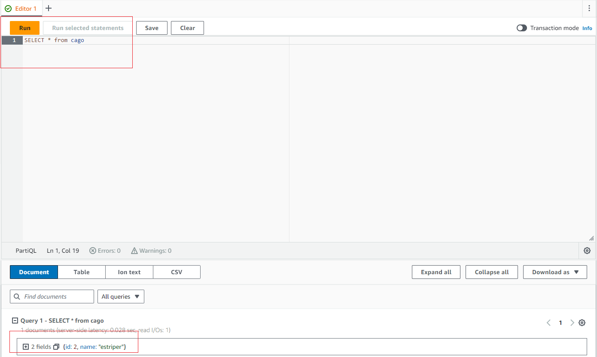

### AWS QLDB demo

## Abstract

>Amazon Quantum Ledger Database (Amazon QLDB) is a fully managed ledger database that provides a transparent, immutable, and cryptographically verifiable transaction log.

For this demo I use [amazon-qldb-driver-rust](https://github.com/awslabs/amazon-qldb-driver-rust).
I decided to use this crate because the API it provides is much simpler than [aws-sdk-qldb](https://docs.rs/aws-sdk-qldb/latest/aws_sdk_qldb/) and [aws-sdk-qldbsession](https://docs.rs/aws-sdk-qldbsession/latest/aws_sdk_qldbsession/).

This demo shows how to work with qldb using Rust, specifically:
- how to create tables;
- insert data;
- delete data;
- and query;

## Result



## Try it out!

1. Create ladger with name `kawasaki`.
2. Install [Rust](https://rustup.rs/).
3. Set up enviroment variables:
 - Windows:
 ```shell
 setx AWS_ACCESS_KEY_ID your_access_key_id
 setx AWS_SECRET_ACCESS_KEY your_secret_access_key
 setx AWS_DEFAULT_REGION default_region
 ```
 - Linux
 ```bash
 export AWS_ACCESS_KEY_ID=your_access_key_id
 export AWS_SECRET_ACCESS_KEY=your_secret_access_key
 export AWS_DEFAULT_REGION=default_region
 ```
 - Or create an .env file and change these variables there.
4. Run the app
```bash
cargo run
```